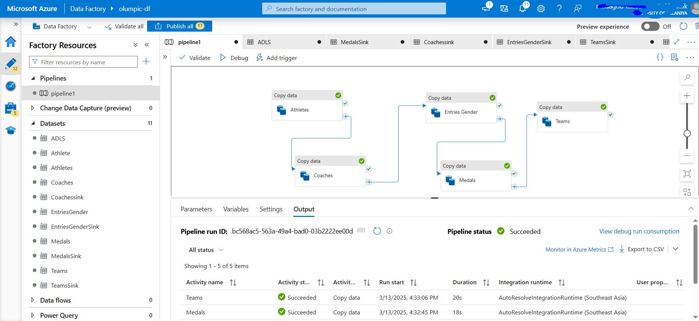
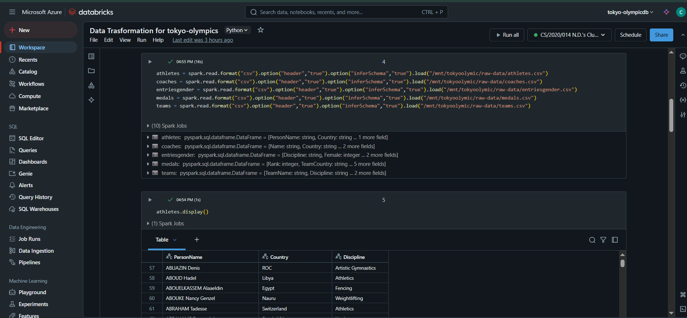
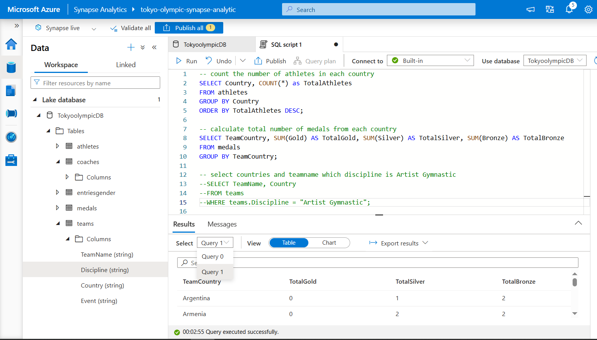
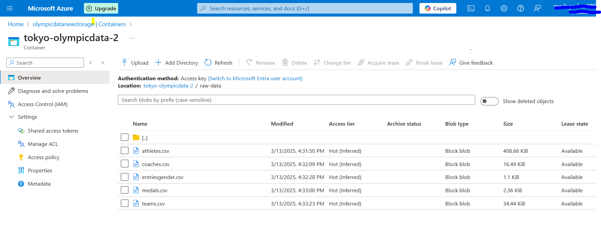

# 🏅 Olympic Data Analytics Using Azure

This project showcases how cloud-based data analytics can be applied to extract insights from historical Olympic Games data using Microsoft Azure services.

## 🎯 Objective

To analyze Olympic data to uncover trends and insights such as medal counts, athlete performance, and country comparisons, leveraging the power of **Azure data services** and **Power BI**.

## 🛠 Tools & Technologies

- **Microsoft Azure**
  - Azure Data Lake Storage
  - Azure Synapse Analytics / Azure SQL Database
  - Azure Data Factory (ETL)
- **Power BI** (for dashboard and visualization)
- **Python** / **PySpark** (optional for preprocessing)
- **Blob Storage / CSV** for raw data input

## 🔄 Workflow

1. **Data Ingestion**  
   - Uploaded raw Olympic datasets into Azure Data Lake

2. **Data Transformation**  
   - Used Azure Data Factory to orchestrate data flow  
   - Cleaned and transformed data using SQL or Spark in Azure Synapse

3. **Data Modeling**  
   - Structured data into fact and dimension tables for analytics

4. **Visualization**  
   - Built interactive Power BI dashboards to visualize insights such as:
     - Country-wise medal tally
     - Gender participation over time
     - Athlete performance trends
     - Sport popularity by year

5. **Deployment**  
   - Published Power BI reports for organizational use

## 📊 Key Insights

- Top-performing countries across decades
- Rise in women participation over time
- Dominant sports by region
- Medal distribution trends and anomalies

## 📷 Sample Dashboard

## 🚀 Future Enhancements

- Integrate real-time data updates using Azure Stream Analytics
- Add predictive modeling for medal forecasts
- Enable user-level access through Power BI workspace roles

---

Let me know if you want this exported as a file or tailored to a specific Azure setup you used.

